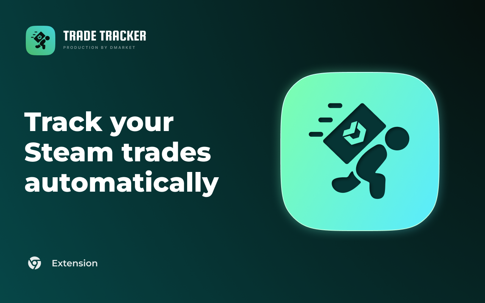

# DMarket Trade Tracker

<!--
  `circle-token` below is a CircleCI status-badge token: read-only, scoped to this branch's build
  status alone (no logs, artifacts, env, contexts or pipeline control). A private project's badge 404s
  without it, hence it is committed. The CircleCI project is kept private even though this repository
  is public ("Free and Open Source" is off in Project Settings → Advanced), so the token stays. Rotate it
  in Project Settings → Status Badges; do not "fix" the badge by removing the parameter.
-->

[](https://dl.circleci.com/status-badge/redirect/gh/dmarket/p2p-extension/tree/main)
[](https://github.com/dmarket/p2p-extension/releases)

<!--
  `align` is obsolete in HTML, but GitHub's markdown sanitizer strips `style` from both `<p>` and
  `<div>`, so it is the only way left to centre an image in a README. No `width` either: GitHub adds
  `max-width: 100%` to every image itself, so a 1280px source is capped to the content column and
  only ever scaled DOWN, which keeps the text sharp when the page is zoomed.
-->

<p align="center">
  
</p>

A browser extension (Chrome, Manifest V3) that watches your Steam trade offers and verifies P2P
trades against your DMarket deals. It bundles the DMarket P2P trade-tracker core (compiled from
Kotlin Multiplatform) and drives it from a Manifest V3 service worker.

> The trade-tracker business logic lives in a separate library —
> [dmarket/p2p-tracker-core](https://github.com/dmarket/p2p-tracker-core) — consumed as the published
> npm package [`@dmarket/p2p-tracker-core`](https://www.npmjs.com/package/@dmarket/p2p-tracker-core)
> behind a single import seam (`src/core/tracker.ts`). This repository owns the extension shell: the
> service worker, the popup, the on-page onboarding UI, and the page bridge.

## Requirements

- Node.js 22+ (WXT's own floor)
- npm 10+
- A Chromium-based browser for loading the unpacked build

## Getting started

```bash
npm install          # installs deps and runs `wxt prepare`
npm run dev          # dev build with hot reload (Chrome); includes the debug console
npm run build:debug  # loadable debug build → .output/chrome-mv3-dev (debug console included)
npm run build        # production build → .output/chrome-mv3 (debug tooling excluded)
npm run zip          # packaged production zip
npm run zip:debug    # packaged debug zip (same build as build:debug, zipped)
npm run check        # the full gate: compile (tsc + guards) + lint + unit tests
npm run compile      # type-check and guard scripts only
npm test             # unit tests only (Vitest)
npm run lint         # ESLint only
```

Load the unpacked extension via `chrome://extensions` (Developer mode → Load unpacked): use
`.output/chrome-mv3-dev` for a debug build or `.output/chrome-mv3` for a production build. A packaged
production build of each release is attached to its
[GitHub Release](https://github.com/dmarket/p2p-extension/releases).

`npm run check` is the gate, and it is exactly what CI runs. Formatting is deliberately not
enforced — there is no Prettier configuration, so running Prettier here reformats whole files with
its own defaults.

### Firefox

Chrome is the shipping target. A Firefox build exists and is code-complete but **has not been
live-validated**, so treat it as unreleased: `npm run build:firefox`, `npm run build:debug:firefox`,
`npm run zip:firefox` → `.output/firefox-mv3*`. Same sources; the manifest gains `webRequest` (the
anti-CSRF path there is blocking `webRequest` rather than declarativeNetRequest) and a
`browser_specific_settings.gecko` block. Load it via `about:debugging`. Host permissions are opt-in
on Firefox MV3, so a development build needs them granted by hand in `about:addons`.

## Configuration

Copy `.env.example` to `.env` and fill in the values you need. Every integration (error reporting,
remote config) is optional and stays inactive until its variables are present, so the
extension builds and runs with an empty `.env`. Only `WXT_`-prefixed variables are exposed to the
bundle.

Two things are compiled in rather than configured, because their absence is silent and expensive: the
DMarket API and FE origins, and the production notary URL. So a production build arms the real TLSN
prover with no configuration at all; remote config can redirect the notary but can no longer switch it
off. The `WXT_DEV_*` variables override these in development builds only, and are dead code in a
production one.

## Debugging

The extension ships a **debug console** — a developer-only dashboard for inspecting the tracker at
runtime. It is compiled into development builds only and is stripped entirely from production builds
(`npm run build` / `npm run zip`).

Build a loadable debug build and load `.output/chrome-mv3-dev` unpacked:

```bash
npm run build:debug
```

Open it from the popup's “debug console” link (dev builds only), or navigate to the extension's
`debug.html`. It provides:

- a **live network log** of the core's HTTP traffic — each request as a copy-pasteable `curl`, with
  the decoded response, and the core's lifecycle frames interleaved in causal order. Credentials are
  redacted at capture time; identifiers (steamids, deal ids, `deviceId`) are deliberately kept, since
  they are what the log exists to correlate;
- **session status**: core version, next-heartbeat countdown, Steam/DMarket sign-in indicators, the
  mirrored `block:` reason, which prover the core resolved (`prover:`), and the outcome of the last
  proof (`proof:`) — a prover being *configured* and a proof being *attempted* are different facts,
  so they get separate pills;
- an **endpoint switcher** for the **FE**, **API** and **notary** URLs, with **Prod / Stage / Dev**
  prefill buttons for the first two (debug builds default to Dev). FE and API restart the tracker in
  place; the notary URL is applied independently;
- **force tick** (an immediate heartbeat), **retry proof** (restart the tracker so a proof the core
  has latched off as refused is attempted again) and **refresh config** (fetch remote config now,
  bypassing the 1 h throttle). Each writes its outcome to the session log rather than to a transient
  pill, so it is timestamped against the traffic it caused;
- a **blocking-state simulator**: reproduce any state in the chain — no DMarket session, no Steam
  session, wrong Steam account, onboarding not completed, DMarket error — by its *real cause* (the
  core is pointed at a cookie name nothing holds, or a heartbeat reply is synthesised), not by
  overwriting the mirrored reason. Rails refuse the Steam session-transfer and DMarket
  `refresh-token` endpoints while armed, so simulating a signed-out state cannot rotate a live
  credential. This is also where the activation flag is toggled;
- a **freshness-mark injector** for demand-driven proving, pinned to the storage row that holds the
  core's answer;
- a **`chrome.storage.local` inspector/editor** to view, edit, add and remove persisted keys.
  JSON-in-string values are expanded for reading while `edit` still shows the raw stored value, and
  credentials are rendered through the redactor (so a row's `steam_id` and expiry are readable
  without exposing the token).

### Pointing Steam at a local stand-in

Steam's hosts are hard-coded in the tracker core, so the Steam-coupled flows (session refresh, trade
send, cancel) normally need a live Steam account. Set `WXT_DEV_STEAM_URL` to a local origin and a
non-production build sends every Steam request the core makes there instead — in an ordinary browser
window, with no launch flags. Only `fetch` is redirected: the Steam session cookie is still read from
the real `steamcommunity.com` origin, so set that cookie by hand for Steam to read as connected.
Unset (the default) means real Steam, and production builds ignore the variable entirely.

## CI & releases

CircleCI (`.circleci/config.yml`). Every push runs:

| Job | Waits for | What it does |
|---|---|---|
| `check` | — | `npm run compile` (tsc + the guard scripts), `npm run lint`, `npm test` |
| `build-prod` | `check` | production zip → the job's **Artifacts** tab |
| `build-debug` | `check` | development zip (debug console, internal endpoints) → **Artifacts** |

The two builds run in parallel with each other, but neither starts until the checks pass — an
installable artifact should never come from a pipeline whose own checks are red.

Both zips are meant to be installed by hand: download, unzip, then `chrome://extensions` →
Developer mode → **Load unpacked**. Each build is verified by `scripts/verify-build.mjs`, which
checks the manifest version and `version_name`, the production permission/host surface, the absence
of debug tooling and of a wrapped `fetch` from a production bundle, that the production notary URL is
present (without it the core silently runs the no-op prover and every `proofRequired` deal stalls),
and that the TLSN prover was copied in. It also asserts the inverse for a development build, since
`wxt build` without `--mode development` produces a directory that looks fine and has no debug
console in it.

### Cutting a release

1. Pin `@dmarket/p2p-tracker-core` to an exact **stable** version (`npm install`, commit the
   lockfile) — currently `1.0.0-beta.1`. A build made against a `-SNAPSHOT` core is never released:
   a snapshot can be unpublished from npm, which would make the published build unreproducible. Note
   that `npm run core:latest` deliberately moves the pin onto the newest snapshot for development
   work, so put it back before releasing.
2. Bump `version` in `package.json`. This is the single source of truth: WXT derives the manifest
   version from it, the zips are named from it, and the tag is `v` + it. A SemVer prerelease suffix
   is fine — Chrome accepts only 1–4 dot-separated integers, so WXT puts the numeric prefix in
   `manifest.version` and the full string in `version_name` (which is what Chrome shows on the
   extension card). `1.0.0-beta.1` ships as version `1.0.0` / version_name `1.0.0-beta.1`.
3. Add the matching `## [x.y.z]` section to [CHANGELOG.md](CHANGELOG.md) — it becomes the release
   notes, and the release fails without it.
4. Merge to `main`, then **approve `hold_release`** in CircleCI.

Only then does CI tag `v<version>` and publish a GitHub Release with the production zip, a sourcemaps
archive (for symbolicating crash reports), the production manifest and `SHA256SUMS`. A prerelease
version (`0.x`, or anything with a `-suffix`) is marked **Pre-release** on GitHub, so it is not
presented as the Latest release.

The debug build is deliberately **not** published — it is not what ships, and it inlines the internal
`WXT_DEV_*`/`WXT_STAGE_*` endpoints. Download it from the `build-debug` job's **Artifacts** tab in
CircleCI, on any push.

A push to `main` whose version is already tagged releases nothing, so ordinary merges are safe;
`[skip release]` in the commit message skips it explicitly.

Publishing to the Chrome Web Store is a **second, separately approved** job triggered by the tag. It
is currently a stub: it verifies the published artifact's checksum and prints the upload command
without running it, because there is no store listing yet.

## Project layout

```
src/
  entrypoints/       # service worker, popup, content scripts, offscreen document, debug page
  background/        # service-worker glue: anti-CSRF, toolbar icon, cookie watch, bridge router
  config/            # compiled-in defaults, the remote-config overlay, core parameter order
  core/              # single import seam for the tracker core, plus the notary proof delegate
  messaging/         # typed message contracts + the dmarket.com page bridge
  state/             # activation flag, mirrored blocking reason, and the surface resolver
  infra/             # error reporting, remote config (opt-in)
  debug/             # developer-only debug console service-worker glue (dev builds only)
  ui/                # popup, on-page UI, and debug-console components
  util/              # redaction, storage-event registrar, match patterns
  assets/            # icons used by the popup and on-page UI
  testing/           # shared test stubs
```

`scripts/` holds four guards that mechanise invariants a unit test cannot reach. Three run as part of
`npm run compile`: the core's positional configuration order against the installed package
(`check-core-params`), the blocking-state priority table against the core's own resolver
(`check-surface-priority`), and the create-trade cause mapping (`check-create-trade-cause`). The
fourth, `verify-build`, needs a built output and runs in CI's build jobs (`npm run verify:build`).

## Tech stack

- [WXT](https://wxt.dev) — Manifest V3 build framework
- [Preact](https://preactjs.com) — UI
- TypeScript
- [Vitest](https://vitest.dev) — unit tests, with WXT's fake-browser extension APIs
- [ESLint](https://eslint.org) — type-aware linting (`typescript-eslint`); no formatter
- [`@dmarket/p2p-tracker-core`](https://github.com/dmarket/p2p-tracker-core) — the trade-tracker
  business logic, compiled from Kotlin Multiplatform

## License

See [LICENSE](LICENSE).
